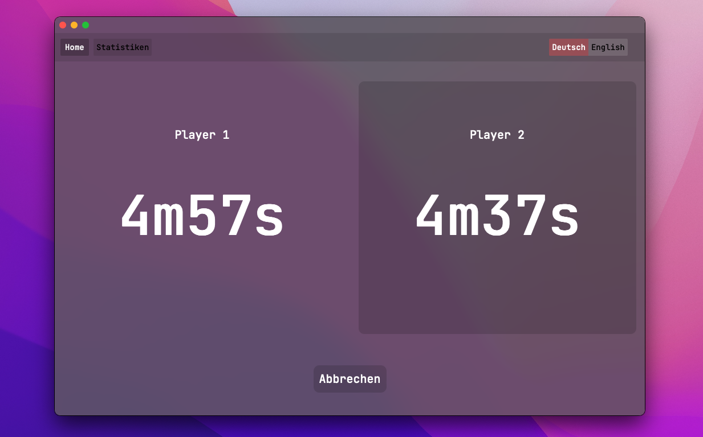

# GoChessClock

Digital cross-platform chess clock written in Go using Wails.

## Showcase

## ToDos

Not all features have been implemented yet. I've mainly created this repo to test out wails for the first time.

- [ ] Statistics page is currently empty
- [ ] Allow the user to change times and usernames
- [ ] Allow the user to customize the appearance